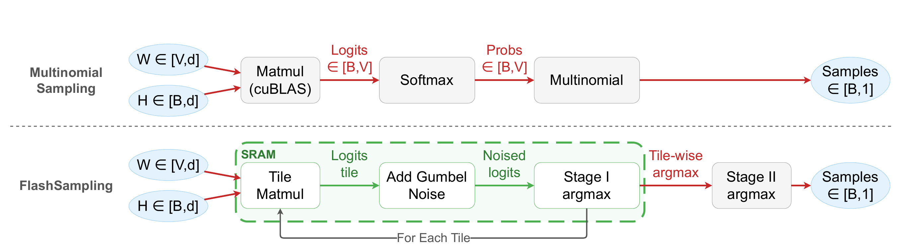
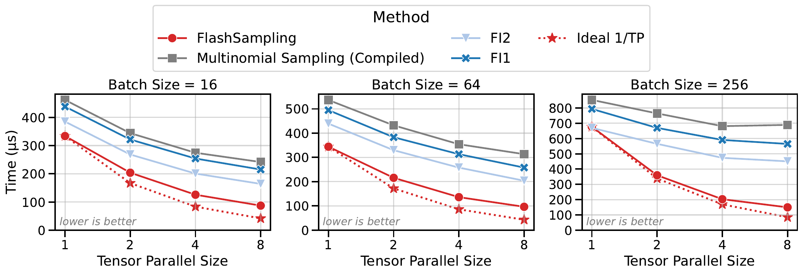

# FlashSampling

[](https://arxiv.org/abs/2603.15854)
[](https://flashsampling.github.io/FlashSampling)
[](LICENSE)
[](https://www.python.org/downloads/)

### FlashSampling: Fast and Memory-Efficient Exact Sampling

**FlashSampling** is an exact sampling primitive that fuses categorical sampling into the LM-head matmul and never materializes the logits tensor in HBM.
It computes logits tile-by-tile on chip, adds Gumbel noise, keeps one maximizer per row and per vocabulary tile, and finishes with a small reduction over tiles.
In end-to-end vLLM decoding, it reduces time per output token by up to 10% on the models we test.

**Authors**: [Tomas Ruiz](https://tomasruizt.github.io/about.html)\*, Zhen Qin\*, [Yifan Zhang](https://yfz.ai)†, Xuyang Shen, Yiran Zhong, Mengdi Wang†  
**Affiliations**: LMU Munich, Princeton University, FlashSampling  
**Date**: February 28, 2026 (revised May 6, 2026)

\* Equal contribution. † Corresponding authors.

[[Paper](FlashSampling.pdf)] [[arXiv](https://arxiv.org/abs/2603.15854)] [[Webpage](https://flashsampling.github.io/FlashSampling)] [[Hugging Face](https://huggingface.co/papers/2603.15854)] [[Reproduction Guide](REPRODUCTION.md)]



Conventional multinomial sampling (top) materializes the full $[B,V]$ logits tensor in HBM between the matmul and the sampler.
FlashSampling (bottom) fuses sampling into the matmul epilogue, followed by a lightweight reduction over vocabulary tiles.
Red arrows denote HBM traffic; green arrows denote on-chip data movement.

## Abstract

Sampling from a categorical distribution is mathematically simple, but in large-vocabulary decoding, it often triggers extra memory traffic and extra kernels after the LM head. We present **FlashSampling**, an exact sampling primitive that fuses sampling into the LM-head matmul and never materializes the logits tensor in HBM. The method is simple: compute logits tile-by-tile on chip, add Gumbel noise, keep only one maximizer per row and per vocabulary tile, and finish with a small reduction over tiles. In tensor-parallel decoding, FlashSampling replaces the all-gather of logits with streaming peer-to-peer writes: This overlaps GPU-to-GPU communication with computation and HBM loads across up to 8 GPUs, with near-ideal scaling at large batch sizes. Our kernel is exact because $\arg\max$ decomposes over partitions; grouped variants for online and tensor-parallel settings are exact by hierarchical factorization of the categorical distribution. FlashSampling demonstrates kernel-level speedups on decode workloads across 4 different datacenter GPUs (H100, H200, B200, B300), and in end-to-end vLLM experiments, it reduces time per output token by up to 10% on the models we test. These results show that exact sampling, with no approximation, can be integrated into the matmul itself, consolidating the bandwidth-bound sampling step in an efficient epilogue.

## Results

- **Kernel speedups.** For batch sizes $B \le 64$, FlashSampling is faster than all three baselines (compiled PyTorch multinomial sampling, FlashInfer top-k/top-p sampling (FI1), and FlashInfer Gumbel-Max sampling (FI2)) on H100, H200, B200, and B300. Its peak speedups are 2.23× over multinomial sampling (B300) and 1.74× over FI1 (B200).
- **Tensor parallelism.** Each GPU writes its per-tile candidates to its peers from inside the matmul, so no logits all-gather is needed. FlashSampling is the fastest method at every tensor-parallel size for batch sizes 16 and 64, and it follows the ideal $1/\mathrm{TP}$ scaling closely at batch size 256.
- **End-to-end vLLM.** On B200, time per output token drops by up to 10.2% (Qwen3-1.7B), 8.7% (Qwen3-8B), 2.9% (Qwen3-32B, TP2), and 2.7% (Llama-3.3-70B, TP2).
- **Exactness.** A chi-squared goodness-of-fit test finds no significant difference from the PyTorch reference sampler, and Qwen3-1.7B reaches 89.4% on GSM8K with FlashSampling versus 89.6% with the baseline ($p = 0.776$).



Kernel runtime (lower is better) of FlashSampling and the three baselines at tensor-parallel sizes 1, 2, 4, and 8 ($D = 8192$, $V = 128\text{k}$).

## Quick Start

FlashSampling is a Triton kernel and needs an NVIDIA GPU.

```bash
git clone https://github.com/FlashSampling/FlashSampling.git
cd FlashSampling
pip install -e .
python examples/basic_usage.py
```

```python
import torch
from fused_mm_sampling.core import fused_mm_sample_triton

samples = fused_mm_sample_triton(
    weights=weights,              # [vocab_size, hidden_size], LM-head weights
    hidden_states=hidden_states,  # [batch_size, hidden_size]
    num_samples=1,
    temperature=torch.tensor(1.0, device="cuda"),  # scalar (0-d) CUDA tensor
    seed=0,
)  # [batch_size, num_samples] token indices
```

For tensor-parallel sampling over a vocabulary-sharded LM head, see [`examples/tensor_parallel.py`](examples/tensor_parallel.py) (`torchrun --nproc_per_node=2 examples/tensor_parallel.py`).
The vLLM integration is on the `feature/fmms-sampler` branch of [tomasruizt/vllm](https://github.com/tomasruizt/vllm/pull/13).

## Reproducing the Paper

[REPRODUCTION.md](REPRODUCTION.md) maps the paper's tables and figures to the `make` targets that produce them, for both the kernel microbenchmarks and the end-to-end vLLM benchmarks.

## Citation

```bibtex
@article{ruiz2026flashsampling,
  title={FlashSampling: Fast and Memory-Efficient Exact Sampling},
  author = {Ruiz, Tomas and Qin, Zhen and Zhang, Yifan and Shen, Xuyang and Zhong, Yiran and Wang, Mengdi},
  journal={arXiv preprint arXiv:2603.15854},
  year={2026}
}
```

## 📜 License

This project is licensed under the [Apache License 2.0](LICENSE).
